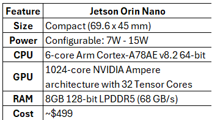
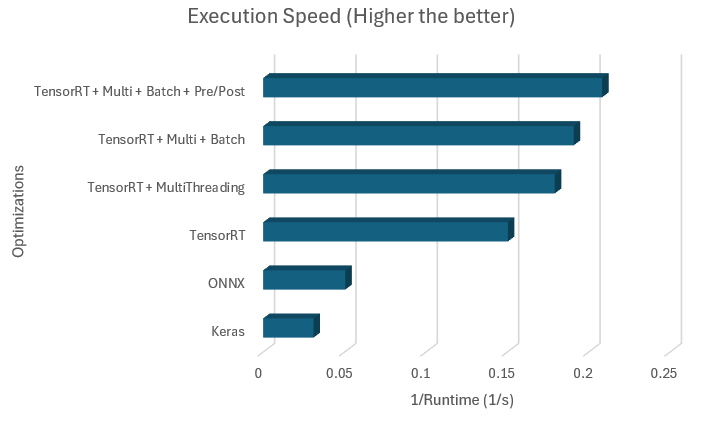
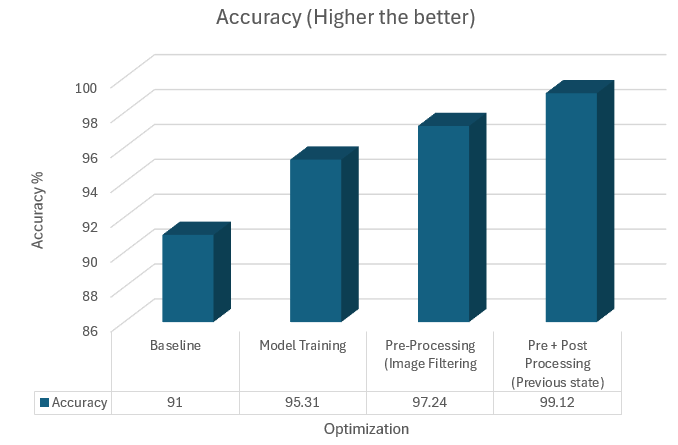
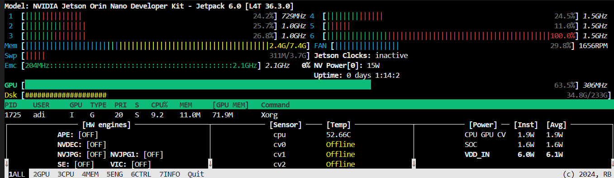
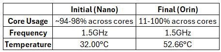
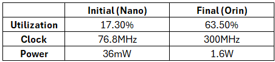
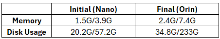
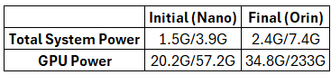

**University of Pennsylvania, CIS 5650: GPU Programming and Architecture,
ChessVision**

* Manvi Agarwal [LinkedIn](https://www.linkedin.com/in/manviagarwal27/)
* Adithya Rajeev [LinkedIn](https://www.linkedin.com/in/adithyar262/)
* Kevin Dong [LinkedIn](https://www.linkedin.com/in/xingyu-dong)

## Hardware Specifications

# ChessVision

## Project Overview 

ChessVision is a computer vision project designed to digitize a chessboard for real-time game analysis and potential cheat detection. It uses a camera to capture images of a chessboard, then processes these images to detect the board and identify the pieces. This information is then converted into a digital board format (FEN) for further analysis.  

Our goal was to achieve real-time chessboard detection and piece inference using a Jetson Nano and camera, taking snapshots of the board periodically for analysis. We aimed to improve upon the existing LiveChess2FEN project by reducing inference time and improving model accuracy.  

The existing solution for real-time over the board games use electronic boards which are expensive and can be difficult to carry around. With Chess popularity increasing, having an inexpensive tool for live digitization of chess board will be useful. 

## Forsyth-Edwards Notation (FEN)

Forsyth-Edwards Notation, commonly known as FEN, is a compact way to describe a specific chess position using a single line of text. It's like taking a snapshot of a chess board and encoding it into a standardized format that both humans and computers can understand.

### Key aspects of FEN:

- **Board representation**: FEN describes the placement of pieces on all 64 squares of the chess board, starting from the 8th rank (top) to the 1st rank (bottom)3
- **Piece notation**: It uses letters to represent pieces - uppercase for White (e.g., K for King, Q for Queen) and lowercase for Black (e.g., k for king, q for queen)
- **Empty squares**: Numbers are used to represent consecutive empty squares on a rank5
- **Additional information**: Beyond piece positions, FEN includes details like whose turn it is to move, castling rights, possible en passant captures, and move counts

### How FEN is generated and used:

- **Generation:** FEN can be created manually by describing a board position or automatically by chess software during gameplay or analysis
- **Uses:**
   - Setting up specific chess positions for analysis or puzzles
   - Sharing board states quickly without needing to list all previous moves
   - Allowing chess engines to evaluate particular positions
   - Restarting games from a specific point
- **Chess software integration:** Many chess programs and websites can interpret FEN, allowing users to quickly set up and share positions

FEN is particularly useful for chess enthusiasts, programmers, and analysts who need a standardized way to communicate chess positions efficiently across various platforms and applications.

## System Schematics

### Pipeline

The ChessVision pipeline involves several steps:

1. **Board Detection**
- The system uses computer vision techniques to identify and isolate the chess board from the input image or video stream.
- This step involves detecting the corners of the board and performing perspective transformation to obtain a top-down view of the board.
- Advanced techniques like YOLO (You Only Look Once) object detection have been tested for improved board corner detection

2. **Square Extraction**

- Once the board is detected, the system divides the board image into 64 individual squares.
- Each square is cropped and preprocessed for piece classification.
- This step requires accurate alignment and scaling to ensure that each sub-square perfectly captures the contents of its corresponding chessboard square. 

3. **Image Processing and Change Detection:**

- The system analyzes each of the 64 squares, comparing them to their previous state.
- Hue and saturation values are extracted for each square and compared against a predefined threshold.
- The preprocessing accounts for different piece-square color combinations:

    - For white pieces on white squares or black pieces on black squares, saturation is high.
    - For white pieces on black squares or black pieces on white squares, hue is high.
    - This approach helps mitigate lighting issues such as shadows.
- Only squares that exhibit changes exceeding the threshold are marked for further processing, reducing the computational load on the next step.

**Original image - **

**Hue and Saturation image -**

This enhanced preprocessing step ensures more robust detection across various lighting conditions and board configurations, improving the overall accuracy of the change detection process

4. **Piece Classification**

- Each of the changed squares is passed through a deep learning model for piece classification.
- Multiple models have been tested and optimized, including:
    - EfficientNet B7
    - ResNet 152 V2
    - Xception
    - YOLOv11
- The system uses batch processing to improve efficiency and reduce inference time
- Probability analysis has been enhanced to improve classification accuracy

5. **Board State Analysis and Post-Processing**

- The results from piece classification are combined to create a complete board state.
- The system analyzes the positions of all pieces on the board.
- Advanced CHess logic is applied to resolve ambiguities and improve overall accuracy.

6. **FEN Generation**

- The board state is converted into Forsyth–Edwards Notation (FEN), a standard notation for describing chess positions.
- This step involves translating the piece positions into a compact string representation.
- The output is a FEN string that accurately reflects the state of the captured chessboard. 

7. **2D Board Rendering**

- Creates a 2D digital representation of the chess board using the generated FEN
- Includes an analysis bar on the side of the rendered board
- Provides visual output for easy verification of the detected board state and position evaluation

## Real-time Processing

The ChessVision pipeline is optimized for continuous analysis of live chess games, implementing various strategies to enhance performance and reduce inference time:

### Optimizations for Speed

- **TensorRT Acceleration**: Utilizes NVIDIA's TensorRT to optimize deep learning models, significantly reducing inference time. For example, ResNet 152 V2 inference time was reduced from ~40s (Keras) to ~6s (TensorRT)
- **Batch Processing**: This optimization, along with other efficiency improvements, has helped reduce the overall inference time. For example, ResNet 152 V2 inference time reduced from ~23s (Keras) to ~5s (TensorRT)
- **Reduced Disk I/O**: While specific values for disk I/O improvements are not obvious, this optimization, combined with others, has contributed to an overall reduction in processing time of approximately 1-2 seconds
- **Only process changed squares**: Detecting and processing only the squares that have changed between frames, reduced the total no. of inferences run per from from 64 to 5-10.

### Image Processing Enhancements

- **Pre-processing**: Implements change detection by comparing hue and saturation values of current and previous square states, reducing the number of squares that need classification
- **Post-processing**: Improves probability analysis and square cropping techniques for better accuracy

### Parallel Processing

- **Multi-threading**: Utilizes multi-threading to process different pipeline stages concurrently, enhancing overall system responsiveness.
- **GPU Utilization**: Maximizes the use of available GPU cores for parallel processing of image classification tasks2

### Model Optimization

- **Efficient Models:** Employs smaller, faster models like AlexNet and SqueezeNet alongside larger, more accurate models to balance speed and precision
- **Piece Detection with YOLO**: Explores YOLO object detection for potential improvements in both accuracy and speed, with YOLOv11 achieving ~7s inference time. The model was dropped due to significant drop in accuracy.

These optimizations work in concert to create a responsive, real-time chess analysis system capable of handling the rapid pace of live chess games, including fast-paced formats like bullet chess

## Performance Analysis
The optimization results validate the effectiveness of the implemented strategies, showing significant improvements in both accuracy and processing speed.

### Execution Speed

The execution speed graph shows dramatic improvements through layered optimizations:

- Basic TensorRT implementation achieved 0.15 1/s, significantly outperforming base Keras (0.025 1/s) and ONNX (0.05 1/s)
- Adding multi-threading improved performance to approximately 0.18 1/s
- Combining TensorRT with multi-threading and batch processing reached 0.22 1/s
- The full optimization stack (TensorRT + Multi-threading + Batch + Pre/Post processing) achieved the highest speed at 0.25 1/s, representing a 10x improvement over the baseline Keras implementation

### Accuracy

The accuracy graph demonstrates the cumulative impact of optimizations:

- The baseline model achieved 91% accuracy
- Model training optimizations boosted accuracy to 95.31%, showing a 4.31% improvement
- Pre-processing with image filtering further increased accuracy to 97.24%, particularly due to the implementation of change detection and improved square cropping
- The combination of pre and post-processing techniques achieved the highest accuracy of 99.12%, representing an 8.12% total improvement from baseline

### Optimization Effectiveness
The data confirms that the implemented optimizations were successful:

- The "only process changed squares" strategy contributed to the dramatic speed improvements seen in the TensorRT implementations
- Multi-threading and batch processing optimizations showed clear additive benefits to execution speed
- The pre and post-processing enhancements not only improved accuracy but maintained high execution speeds
- The combination of GPU utilization and parallel processing strategies resulted in the highest performance metrics

### Key Findings
The optimization results demonstrate that combining multiple techniques yields the best results:

- Accuracy improves by 8.12 percentage points from baseline to fully optimized model
- TensorRT with multiple optimizations outperforms basic implementations by nearly 5x compared to ONNX and 10x compared to Keras
- Pre and post-processing stages contribute significantly to accuracy improvements while maintaining competitive execution speeds

These optimizations achieve an optimal balance between accuracy and speed, making the model suitable for production deployment.

## Hardware Utilization Analysis

### System Configurations

**Initial Implementation (Jetson Nano)**

    Device: NVIDIA Jetson Nano Developer Kit
    JetPack Version: 4.6 [L4T 32.6.1]
    Memory: 3.9G available
    Storage: 57.2G available

**Final Implementation (Jetson Orin Nano)**

    Device: NVIDIA Jetson Orin Nano Developer Kit
    JetPack Version: 6.0 [L4T 36.3.0]
    Memory: 7.4G available
    Storage: 233G available

### CPU Utilization

The Jetson Nano shows consistently high CPU load (94-98%) across all cores, indicating potential CPU bottlenecking. In contrast, the Orin Nano shows varied utilization (11-100%) with better load distribution, suggesting more efficient processing despite higher operating temperature (52.66°C vs 32°C).

### GPU Utilization

An improvement is visible in GPU usage:
- Nano: 17.3% utilization at 76.8MHz with minimal power draw (36mW)
- Orin: 63.5% utilization at 300MHz with 1.6W power consumption

This indicates much better GPU acceleration and hardware utilization in the final implementation.

### Memory and Storage

Memory management shows significant differences:

- Nano: Using 1.5G of 3.9G available RAM (38% usage)
- Orin: Using 2.4G of 7.4G available RAM (32% usage)

Storage utilization increased from 20.2G/57.2G on Nano to 34.8G/233G on Orin, though with proportionally less total capacity used.

### System Power

Power consumption patterns reveal platform differences:

- Nano: Operates at 3.4W total system power with minimal GPU power (36mW)
- Orin: Runs at 6.1W total with higher GPU power draw (1.6W)

The increased power consumption reflects the Orin's more powerful hardware and higher processing capabilities.

**Notes**

- Performance metrics should be interpreted considering the hardware generation gap between Jetson Nano and Orin Nano
- Higher power consumption on Orin Nano is justified by its enhanced processing capabilities
- Fan speed increased from 0 RPM to 1656 RPM in the final implementation for better thermal management
- GPU utilization improvement indicates better hardware acceleration in the final implementation

## Future Developments

- Further optimization for Jetson Nano and Orin platforms
- Continuous improvement of piece prediction logic
- Implementation of multi-perspective captures for improved accuracy

## Additional Information:

- The project is based on the LiveChess2FEN project: [https://github.com/davidmallasen/LiveChess2FEN](https://github.com/davidmallasen/LiveChess2FEN)
- We have improved upon the original project in terms of efficiency and accuracy.

## Milestone Presentations
- [Milestone 1](https://docs.google.com/presentation/d/1U8ps8ubOPQaQodlSa4sc5Am6RymVd1RFZkvMr81juZM/edit?usp=sharing)
- [Milestone 2](https://docs.google.com/presentation/d/1VHaGN9LacqWEvyHqry0u9dCRp4Tq3KSkKzSpWPdE-mc/edit?usp=sharing)
- [Milestone 3](https://docs.google.com/presentation/d/1p_hStFTQr3upH9vLvdIlaWQbT13kGrGzDTNNHWYOgtw/edit?usp=sharing)

## Reference
- LiveChess2FEN (Original Project): [Link](https://developer.nvidia.com/blog/jetson-project-of-the-month-livechess2fen-provides-real-time-game-analysis/)
